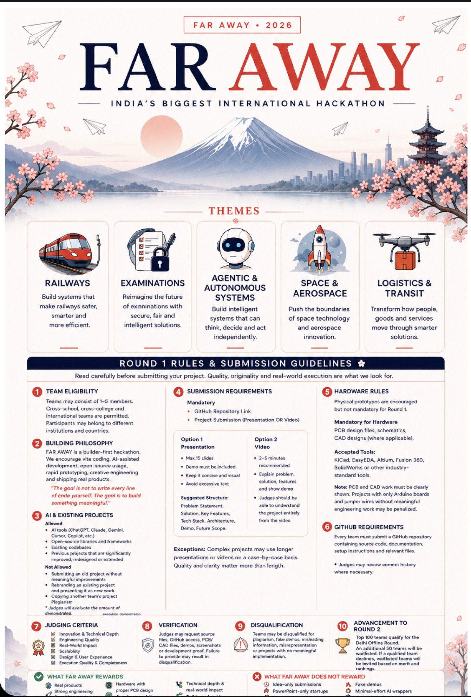
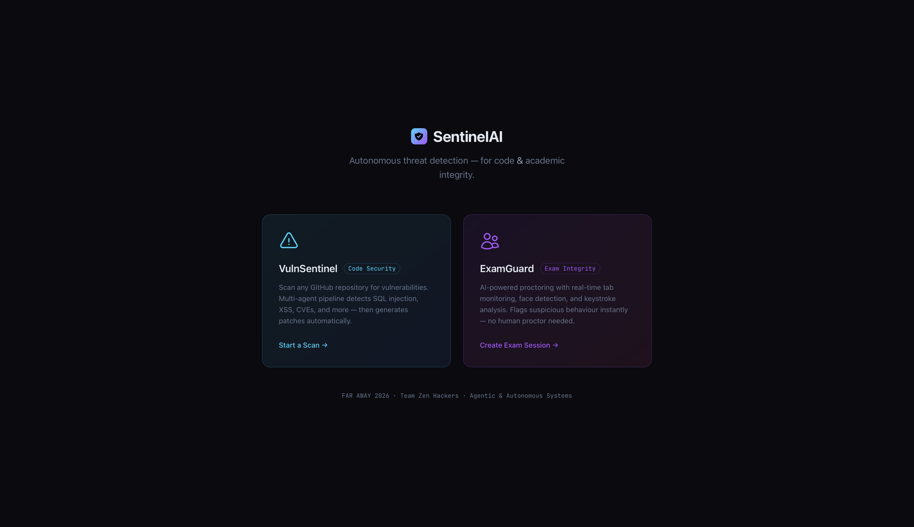
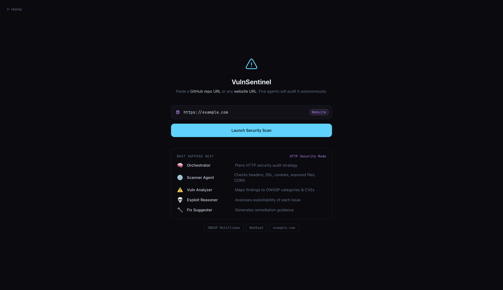
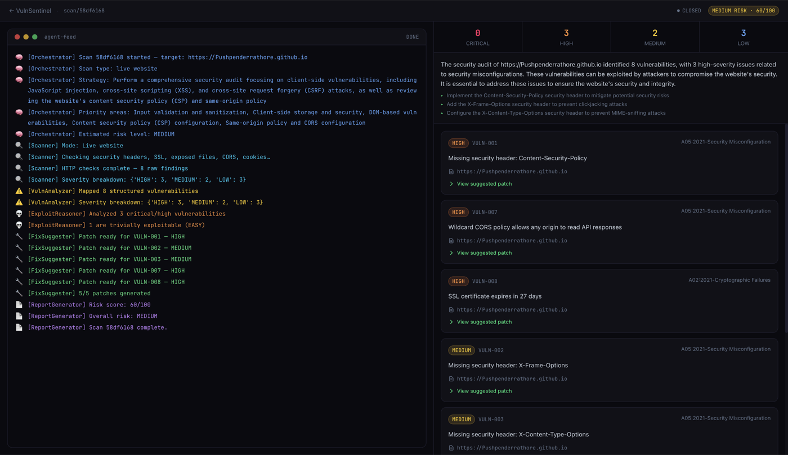
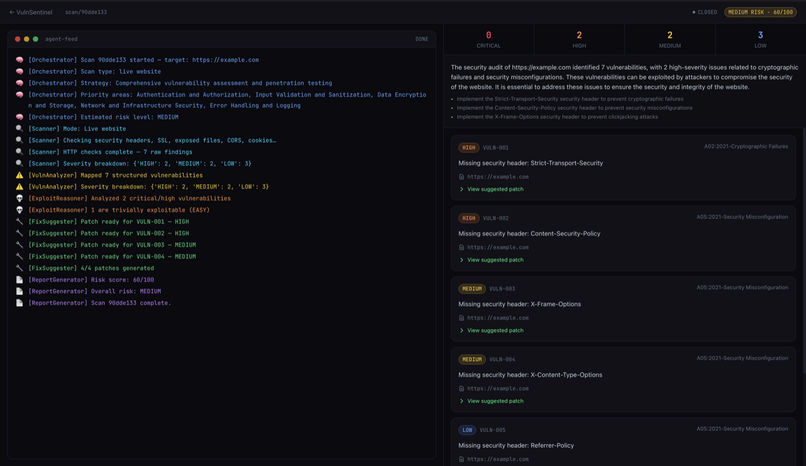
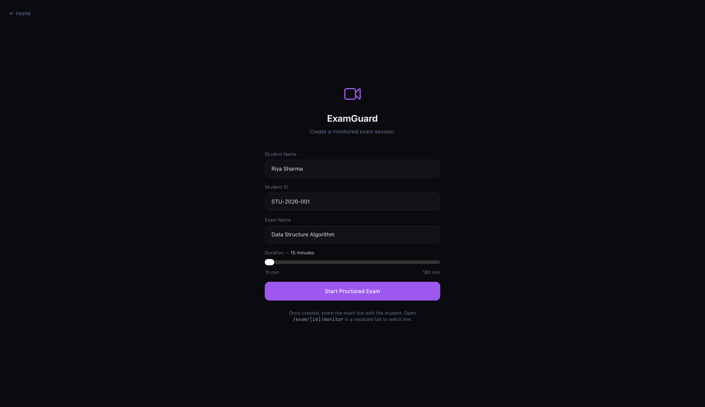
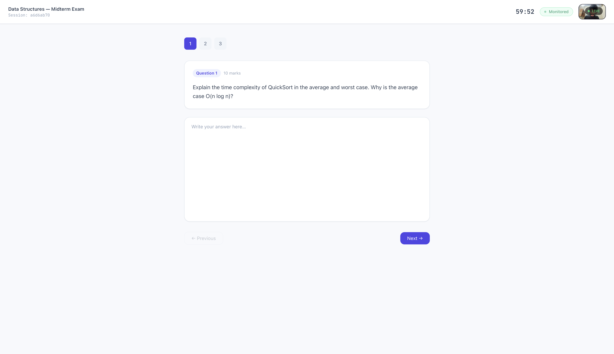
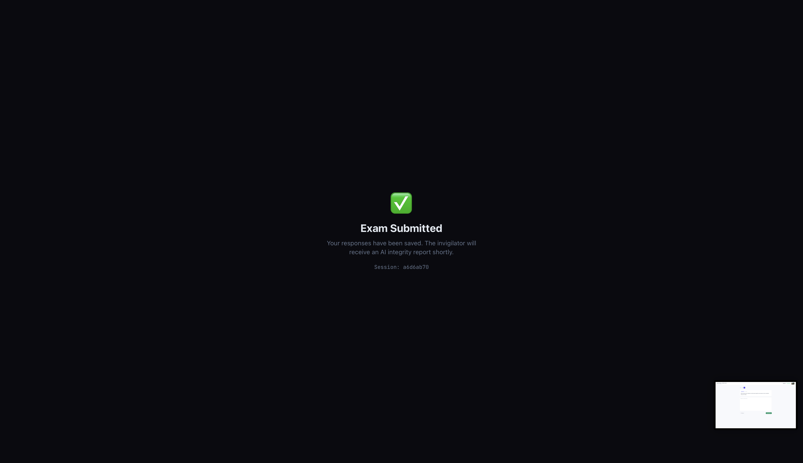
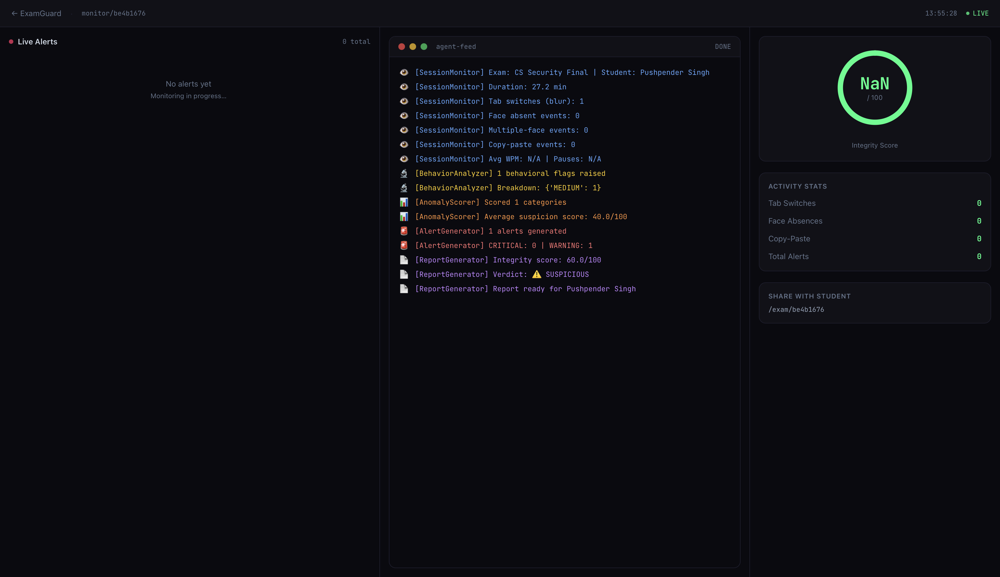
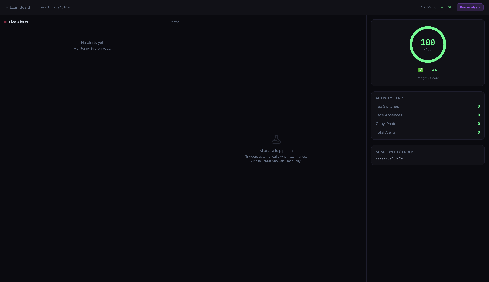

# SentinelAI — Autonomous Threat Detection Platform

> **FAR AWAY 2026 · Team Zen Hackers · Theme: Agentic & Autonomous Systems**



SentinelAI is a multi-agent AI platform that detects threats autonomously — in **source code** and in **online exams** — without requiring human intervention. Two real-world problems. One agentic engine.

---

## Table of Contents

- [Modules](#modules)
- [Demo](#demo)
- [VulnSentinel — Screenshots](#-vulnsentinel--screenshots)
- [ExamGuard — Screenshots](#-examguard--screenshots)
- [Sample Scan Results](#vulnsentinel--dual-scan-mode)
- [Architecture](#architecture)
- [Tech Stack](#tech-stack)
- [Project Structure](#project-structure)
- [Setup & Run](#setup--run)
  - [Prerequisites](#prerequisites)
  - [Backend](#1--backend)
  - [Offline / Ollama fallback](#offline--ollama-fallback-optional)
  - [Frontend](#2--frontend)
- [How It Works](#how-it-works)
  - [VulnSentinel — 6-Agent Pipeline](#vulnsentinel--6-agent-pipeline-github--website)
  - [Website Scanner Checks](#website-scanner-checks)
  - [Port Scanner — CVE/CWE Mapping](#port-scanner--cvecwe-mapping)
  - [ExamGuard — Two-Phase System](#examguard--two-phase-system)
  - [Real-time Alert Thresholds](#real-time-alert-thresholds-examguard)
- [WebSocket Message Protocol](#websocket-message-protocol)
- [API Reference](#api-reference)
- [Team](#team)
- [License](#license)

---

## Modules

### 🔍 VulnSentinel — Autonomous Code & Website Security Auditor
Paste a **GitHub repository URL** or any **live website URL**. VulnSentinel auto-detects the target type and routes to the right scanner — static analysis for repos, HTTP security checks for websites. Five specialised AI agents then map findings to OWASP Top 10 and CVEs, reason about real-world exploitability, generate patches or remediation guidance, and produce a full security report — all without a human in the loop.

### 🎓 ExamGuard — AI-Powered Exam Integrity Monitor
A proctoring system that monitors online exams in real time using tab-switch detection, webcam face analysis, **mobile phone detection**, and keystroke dynamics. Immediate rule-based alerts fire the moment suspicious behaviour is detected. Exams are **automatically terminated** after 5 tab switches. When the exam ends, a second agent pipeline performs deep behavioural analysis and generates an integrity report with a verdict.

---

## Demo

> 📹 **Demo video:** *(add link after recording)*

**Home — SentinelAI module selector**


---

## 🔍 VulnSentinel — Screenshots

**Scan input page — auto-detects GitHub repo or live website URL**


**Live agent feed — website scan of Pushpenderrathore.github.io**


**Live agent feed + findings dashboard — example.com website scan**


---

## 🎓 ExamGuard — Screenshots

**Create a monitored exam session**


**Student exam view — live webcam, timer, and Monitored badge**


**Exam submitted — AI integrity report generated for invigilator**


**Invigilator monitor dashboard — AI agent pipeline running, SUSPICIOUS verdict (60/100)**


**Invigilator monitor dashboard — idle state, 100/100 CLEAN score**


---

### VulnSentinel — Dual scan mode

#### GitHub Repo Scan — OWASP Mutillidae (18 vulnerabilities)

```
Risk Score: 85/100 · Overall Risk: CRITICAL
━━━━━━━━━━━━━━━━━━━━━━━━━━━━━━━━━━━━━━━━
CRITICAL  12   HIGH  4   MEDIUM  2   LOW  0
━━━━━━━━━━━━━━━━━━━━━━━━━━━━━━━━━━━━━━━━
[CRITICAL] A03 Injection  — Command injection via exec() in content-security-policy.php:119
[CRITICAL] A03 Injection  — User data flows into SQL string in edit-account-profile.php:125
[CRITICAL] A07 Sec Misc   — Snyk API Key leaked in .github/workflows/scan-with-snyk-code.yml
[CRITICAL] A07 Sec Misc   — Hardcoded JWT token in src/includes/hints/jwt-hint.inc:46
[HIGH]     A03 Injection  — shell_exec() with unsanitised $domain in dns-lookup.php:165
[HIGH]     A05 Sec Misc   — SSL verification disabled in RemoteFileHandler.php:62
... + 12 more  · 16 auto-generated patches
```

#### Website Scan — brcmcet.edu.in (8 vulnerabilities)

```
Risk Score: 60/100 · Overall Risk: MEDIUM
━━━━━━━━━━━━━━━━━━━━━━━━━━━━━━━━━━━━━━━━
CRITICAL   0   HIGH  2   MEDIUM  3   LOW  3
━━━━━━━━━━━━━━━━━━━━━━━━━━━━━━━━━━━━━━━━
[HIGH]   A02 Cryptographic Failures    — Missing Strict-Transport-Security header
[HIGH]   A05 Security Misconfiguration — Missing Content-Security-Policy header
[MEDIUM] A05 Security Misconfiguration — Missing X-Frame-Options (clickjacking risk)
[MEDIUM] A05 Security Misconfiguration — Missing X-Content-Type-Options header
[MEDIUM] A05 Security Misconfiguration — PHPSESSID cookie missing Secure & HttpOnly flags
[LOW]    A05 Security Misconfiguration — Missing Referrer-Policy header
[LOW]    A05 Security Misconfiguration — Missing Permissions-Policy header
[LOW]    A05 Security Misconfiguration — Server header discloses Apache version
· 5 auto-generated remediation patches
```

### ExamGuard — Real-time proctoring demo

```
[00:12] ⚠  WARNING  Tab switch detected (1/3)
[00:34] ⚠  WARNING  Tab switch detected (2/3)
[00:41] 🚨 CRITICAL Face absent > 30 s continuous
[00:55] 📱 WARNING  Mobile phone detected in camera (conf 87%)
[01:02] ⚠  WARNING  Copy-paste event detected (1/2)
[01:15] 📱 CRITICAL Repeated phone use detected (2×)
[01:44] 🚨 CRITICAL Tab switch threshold reached (5) — exam auto-terminated

Exam auto-terminated after 5 tab switches
Post-session analysis complete
Integrity Score: 42/100 · Verdict: FLAGGED 🚨
```

---

## Architecture

```
┌─────────────────────────────────────────────────────────────────┐
│                     Next.js 14 Frontend                         │
│   / (home)  ·  /scan  ·  /scan/[id]  ·  /exam/[id]  ·         │
│   /exam/[id]/monitor                                            │
└───────────────────┬─────────────────────────────────────────────┘
                    │  REST + WebSocket
┌───────────────────▼─────────────────────────────────────────────┐
│                  FastAPI Backend  (main.py)                      │
├──────────────────────────┬──────────────────────────────────────┤
│   VulnSentinel           │   ExamGuard                          │
│   POST /api/scan         │   POST /api/exam/session             │
│   WS   /ws/{scan_id}     │   GET  /api/exam/session/{id}        │
│   GET  /api/report/{id}  │   WS   /ws/exam/{id}  (bidir)        │
│   GET  /api/scans        │   WS   /ws/exam/{id}/monitor         │
│                          │   POST /api/exam/{id}/analyze        │
│                          │   WS   /ws/exam/{id}/analysis        │
│                          │   GET  /api/exam/report/{id}         │
│                          │   GET  /api/exam/sessions            │
├──────────────────────────┴──────────────────────────────────────┤
│              LangGraph Agent Pipelines                           │
│                                                                  │
│  VulnSentinel                         ExamGuard                  │
│  ┌──────────────────────────┐         ┌─────────────────────┐   │
│  │ orchestrator             │         │ session_monitor      │   │
│  │ → scanner ─┬─ GitHub     │         │ → behavior_analyzer  │   │
│  │            │  (Semgrep+  │         │ → anomaly_scorer     │   │
│  │            │   Bandit)   │         │ → alert_generator    │   │
│  │            └─ Website    │         │ → report_generator   │   │
│  │               (HTTP scan)│         └─────────────────────┘   │
│  │ → vuln_analyzer          │                                    │
│  │ → exploit_reasoner       │                                    │
│  │ → fix_suggester          │                                    │
│  │ → report_generator       │                                    │
│  └──────────────────────────┘                                    │
│  LLM: Groq (primary) → Ollama offline fallback (auto-switch)    │
└─────────────────────────────────────────────────────────────────┘
```

---

## Tech Stack

| Layer | Technology |
|-------|-----------|
| Agent framework | [LangGraph](https://github.com/langchain-ai/langgraph) |
| LLM (primary) | Llama 3.3 70B via [Groq](https://console.groq.com) (free tier, cloud) |
| LLM (offline fallback) | Any local model via [Ollama](https://ollama.com) — auto-switches on rate-limit |
| Backend | Python 3.11 · FastAPI · WebSockets |
| Repo scanning | Semgrep · Bandit (static analysis) |
| Website scanning | HTTP headers · SSL · CORS · cookie · file exposure · port scan (CVE/CWE) |
| Frontend | Next.js 14 · TypeScript · Tailwind CSS |
| Real-time | Native WebSocket (browser ↔ server) |
| Face detection | `@vladmandic/face-api` (TinyFaceDetector — runs in-browser) |
| Phone detection | `@tensorflow-models/coco-ssd` (MobileNet V2 — runs in-browser, "cell phone" class) |

---

## Project Structure

```
sentinelai/
├── backend/
│   ├── main.py                     # FastAPI app — all routes & WebSocket endpoints
│   ├── agents/
│   │   ├── llm_router.py           # Groq-first LLM router with Ollama offline fallback
│   │   ├── state.py                # ScanState TypedDict
│   │   └── orchestrator.py         # VulnSentinel 6-node LangGraph graph
│   ├── exam_agents/
│   │   ├── exam_state.py           # ExamSession TypedDict
│   │   ├── exam_pipeline.py        # ExamGuard 5-node LangGraph graph
│   │   └── event_rules.py          # Rule-based instant alert thresholds
│   ├── tools/
│   │   ├── git_cloner.py           # Repo clone + tech stack detection
│   │   ├── bandit_runner.py        # Python static analysis
│   │   ├── semgrep_runner.py       # Multi-language static analysis
│   │   ├── website_scanner.py      # HTTP security checks (headers, SSL, cookies, exposed files)
│   │   ├── port_scanner.py         # Port scan — 25 ports, CVE/CWE risk mapping
│   │   └── owasp_data.py           # OWASP Top 10 2021 knowledge base
│   └── requirements.txt
└── frontend/
    ├── app/
    │   ├── page.tsx                # Homepage — module selector
    │   ├── scan/
    │   │   ├── page.tsx            # Repo URL input
    │   │   └── [id]/page.tsx       # Live scan dashboard (split-pane)
    │   └── exam/
    │       ├── page.tsx            # Create exam session (with quick-fill examples)
    │       ├── [id]/page.tsx       # Student exam view — proctored, auto-terminates at 5 tab switches
    │       └── [id]/monitor/page.tsx  # Invigilator dashboard — live alerts + AI report
    ├── components/
    │   ├── vulnsentinel/
    │   │   ├── AgentFeed.tsx       # Terminal-style live log stream
    │   │   └── VulnCard.tsx        # Vuln card with collapsible patch diff
    │   └── examguard/
    │       ├── AlertFeed.tsx       # Real-time alert stream
    │       ├── FaceMonitor.tsx     # Webcam feed + face detection + phone detection
    │       └── IntegrityScore.tsx  # Animated circular integrity gauge
    └── lib/
        ├── ws.ts                   # useWebSocket hook
        └── api.ts                  # Typed API client
```

---

## Setup & Run

### Prerequisites
- Python 3.11+
- Node.js 18+
- [Semgrep](https://semgrep.dev/docs/getting-started/) — `pip install semgrep`
- [Bandit](https://bandit.readthedocs.io/) — `pip install bandit`
- Groq API key (free) → [console.groq.com](https://console.groq.com)
- (Optional) [Ollama](https://ollama.com/download) for offline/fallback mode

### 1 — Backend

```bash
cd backend

# Configure environment
cp .env.example .env
# Edit .env — set GROQ_API_KEY=gsk_...  (free at console.groq.com)

# Install dependencies
python -m venv .venv && source .venv/bin/activate
pip install -r requirements.txt

# Start server
bash run.sh
# → http://localhost:8000
# → http://localhost:8000/docs  (Swagger UI)
```

### Offline / Ollama fallback (optional)

SentinelAI works fully offline using a local Ollama model. No internet or API key required.

```bash
# 1 — Install Ollama
#     macOS:   brew install ollama
#     Linux:   curl -fsSL https://ollama.com/install.sh | sh
#     Windows: download from https://ollama.com/download

# 2 — Pull a model (one-time download)
ollama pull llama3          # 4.7 GB — recommended
# ollama pull mistral       # 4.4 GB — good alternative
# ollama pull phi3          # 2.3 GB — lighter, faster

# 3 — Ollama runs as a background service on port 11434 automatically
#     No extra config needed — SentinelAI detects it automatically.
```

Add to `backend/.env` if you want to customise the model:

```env
OLLAMA_MODEL=llama3
OLLAMA_BASE_URL=http://localhost:11434
```

**How the fallback works:**

| Situation | Active LLM | Agent feed shows |
|-----------|-----------|-----------------|
| Groq working normally | Groq · Llama 3.3 70B | `LLM: Groq / llama-3.3-70b-versatile` |
| Groq rate-limited (429) | Ollama · llama3 | `LLM: Ollama / llama3 (offline)` |
| No internet at all | Ollama · llama3 | `LLM: Ollama / llama3 (offline)` |
| Groq recovers after 30 min | Groq (auto-retry) | `LLM: Groq / llama-3.3-70b-versatile` |

The switch is automatic — no restart needed. The active model is logged in the agent feed at the start of every scan.

### 2 — Frontend

```bash
cd frontend
npm install
npm run dev
# → http://localhost:3000
```

---

## How It Works

### VulnSentinel — 6-Agent Pipeline (GitHub + Website)

VulnSentinel accepts two target types — auto-detected from the URL:

| Target | Scanner used |
|--------|-------------|
| `github.com/owner/repo` | Clone → Semgrep + Bandit static analysis |
| Any website URL | HTTP security checks (headers, SSL, cookies, exposed files, CORS) |

```
User pastes GitHub repo URL or website URL
        │
   [Orchestrator]  Auto-detects target type · plans scan strategy with LLM
        │
   [Scanner]       GitHub → clone + Semgrep + Bandit
                   Website → security headers · SSL cert · cookie flags ·
                             exposed files (/.env, /.git, /wp-config…) ·
                             CORS · server info disclosure
        │
   [Vuln Analyzer]     Maps raw findings → structured vulnerabilities with OWASP + CVE context
        │
   [Exploit Reasoner]  Explains how each HIGH/CRITICAL vuln can be exploited in the real world
        │
   [Fix Suggester]     Generates code patches or HTTP remediation config
        │
   [Report Generator]  Compiles executive summary · risk score · full JSON report
        │
   Results streamed live to the browser via WebSocket
```

#### Website scanner checks

| Check | What it finds |
|-------|--------------|
| Security headers | Missing CSP, HSTS, X-Frame-Options, X-Content-Type-Options, Referrer-Policy, Permissions-Policy |
| Transport security | HTTP instead of HTTPS · HSTS max-age too short · SSL cert expiry |
| Cookie security | Missing `Secure`, `HttpOnly`, `SameSite` flags on session cookies |
| CORS | Wildcard `Access-Control-Allow-Origin: *` |
| Dangerous methods | TRACE, PUT, DELETE enabled |
| Sensitive file exposure | `/.env`, `/.git/config`, `/wp-config.php`, `/phpinfo.php`, `/phpmyadmin`, backup SQL files, Swagger UI |
| Info disclosure | `Server` and `X-Powered-By` headers revealing stack details |

### Port Scanner — CVE/CWE Mapping

When a website URL is scanned, VulnSentinel also performs a parallel port scan across 25 common ports. Each open port is matched against a built-in risk database — no external API calls needed.

| Port | Service | Severity | Key CVEs |
|------|---------|----------|---------|
| 445 | SMB | CRITICAL | CVE-2017-0144 EternalBlue, CVE-2020-0796 SMBGhost |
| 3389 | RDP | CRITICAL | CVE-2019-0708 BlueKeep, CVE-2019-1182 DejaBlue |
| 6379 | Redis | CRITICAL | CVE-2022-0543 Lua RCE — no auth by default |
| 9200 | Elasticsearch | CRITICAL | CVE-2014-3120 RCE — no auth by default |
| 27017 | MongoDB | CRITICAL | CVE-2013-4650 — no auth by default |
| 3306 | MySQL | CRITICAL | CVE-2012-2122 auth bypass |
| 5432 | PostgreSQL | CRITICAL | CVE-2019-9193 RCE via COPY |
| 23 | Telnet | CRITICAL | Cleartext credentials (CWE-319) |
| 21 | FTP | HIGH | CVE-2010-4221, cleartext transfer |
| 22 | SSH | MEDIUM | CVE-2024-6387 regreSSHion |

Each open port appears as a VulnCard in the findings panel showing: port badge, all CVEs, CWE chips, and a fix recommendation.

### ExamGuard — Two-Phase System

**Phase 1 — Real-time (during exam)**
```
Browser detects event (tab switch / face absent / phone in frame / copy-paste)
        │
   WebSocket → event_rules.py
        │
   Rule threshold crossed? → immediate_alert fanned out to invigilator monitor instantly
        │
   Tab switches reach 5? → exam auto-terminated, student sees "Exam Terminated" screen
```

**Phase 2 — Deep analysis (after exam ends)**
```
POST /api/exam/{id}/analyze
        │
   [Session Monitor]    Validates session · computes statistics
        │
   [Behavior Analyzer]  LLM identifies suspicious patterns across the full event log
        │
   [Anomaly Scorer]     Scores each category 0–100 for suspicion level
        │
   [Alert Generator]    Produces prioritised, actionable alerts for the invigilator
        │
   [Report Generator]   Integrity score + CLEAN / SUSPICIOUS / FLAGGED verdict + narrative
        │
   Streamed live to invigilator dashboard via WebSocket
```

### Real-time Alert Thresholds (ExamGuard)

| Trigger | Threshold | Severity |
|---------|-----------|----------|
| Tab switches | 3× | WARNING |
| Tab switches | 5× | CRITICAL + **exam auto-terminated** |
| Face absent | 10 s continuous | WARNING |
| Face absent | 30 s continuous | CRITICAL |
| Multiple faces detected | 2 faces | WARNING |
| Multiple faces detected | 3+ faces | CRITICAL |
| Mobile phone in camera | 1st detection | WARNING |
| Mobile phone in camera | 2nd+ detection | CRITICAL |
| Copy-paste events | 2× | WARNING |
| Copy-paste events | 5× | CRITICAL |

### Mobile Phone Detection

The webcam feed is analysed every 3 seconds using two parallel in-browser ML models:

| Model | Purpose | Size |
|-------|---------|------|
| `@vladmandic/face-api` TinyFaceDetector | Face counting & presence | ~190 KB |
| `@tensorflow-models/coco-ssd` MobileNet V2 | Object detection — "cell phone" class | ~3 MB |

Both models run entirely client-side (WebGL) with no cloud API calls. When a phone is detected:
- A red **📱 PHONE** badge flashes on the camera overlay in the student view
- A `phone_detected` WebSocket event is sent to the backend
- The backend fans out an immediate alert to the invigilator monitor
- The "Phone Detected" counter increments in the Activity Stats panel

---

## WebSocket Message Protocol

### VulnSentinel (`/ws/{scan_id}`)
```jsonc
// Server → Client
{ "type": "update", "node": "vuln_analyzer", "logs": ["..."], "status": "exploiting", "scan_id": "a1b2c3" }
{ "type": "done",   "scan_id": "a1b2c3", "report": { ... } }
{ "type": "error",  "scan_id": "a1b2c3", "message": "..." }
{ "type": "ping" }
```

### ExamGuard event socket (`/ws/exam/{exam_id}`)
```jsonc
// Client → Server
{ "type": "tab_event",       "event_type": "blur",    "timestamp": 1234567890.0 }
{ "type": "face_event",      "face_count": 0,          "confidence": 0.95, "timestamp": 1234567890.0 }
{ "type": "phone_detected",  "confidence": 0.87,       "timestamp": 1234567890.0 }
{ "type": "keystroke_stats", "avg_wpm": 67,             "pause_count": 1, ... }
{ "type": "copy_paste",      "content_length": 342,    "timestamp": 1234567890.0 }
{ "type": "end_exam",        "timestamp": 1234567890.0 }

// Server → Client
{ "type": "immediate_alert", "severity": "CRITICAL", "title": "Mobile Phone Detected", "message": "...", "recommended_action": "..." }
{ "type": "exam_ended" }
```

### ExamGuard monitor socket (`/ws/exam/{exam_id}/monitor`)
```jsonc
// Server → Client  (fan-out of all immediate alerts + exam lifecycle events)
{ "type": "immediate_alert", "severity": "WARNING", "title": "...", "message": "...", "recommended_action": "..." }
{ "type": "exam_ended",      "exam_id": "a1b2c3" }
```

---

## API Reference

### VulnSentinel

| Method | Endpoint | Description |
|--------|----------|-------------|
| `POST` | `/api/scan` | Start a scan · returns `scan_id` + `ws_url` |
| `WS` | `/ws/{scan_id}` | Stream real-time agent progress |
| `GET` | `/api/report/{scan_id}` | Fetch completed report |
| `GET` | `/api/scans` | List all scans |

### ExamGuard

| Method | Endpoint | Description |
|--------|----------|-------------|
| `POST` | `/api/exam/session` | Create exam session · returns `exam_id` |
| `GET` | `/api/exam/session/{exam_id}` | Fetch session info (duration, student name, status) |
| `WS` | `/ws/exam/{exam_id}` | Bidirectional student event stream |
| `WS` | `/ws/exam/{exam_id}/monitor` | Invigilator fan-out stream (alerts + exam lifecycle) |
| `POST` | `/api/exam/{exam_id}/analyze` | Trigger post-session LangGraph analysis |
| `WS` | `/ws/exam/{exam_id}/analysis` | Stream analysis agent progress |
| `GET` | `/api/exam/report/{exam_id}` | Fetch integrity report |
| `GET` | `/api/exam/sessions` | List all sessions |

---

## Team

**Team Zen Hackers** — FAR AWAY 2026

| Name | Role |
|------|------|
| Saee Nikam | Team Lead |
| Pushpender Singh | Backend · Agent Pipelines |
| Vaibhav Haval | Frontend · UI/UX |
| Shreya Magadum | ML · Integration |
| Sonika Kaswan | QA · Presentation |

---

## License

MIT — built for FAR AWAY 2026. Not for production use without security review.
